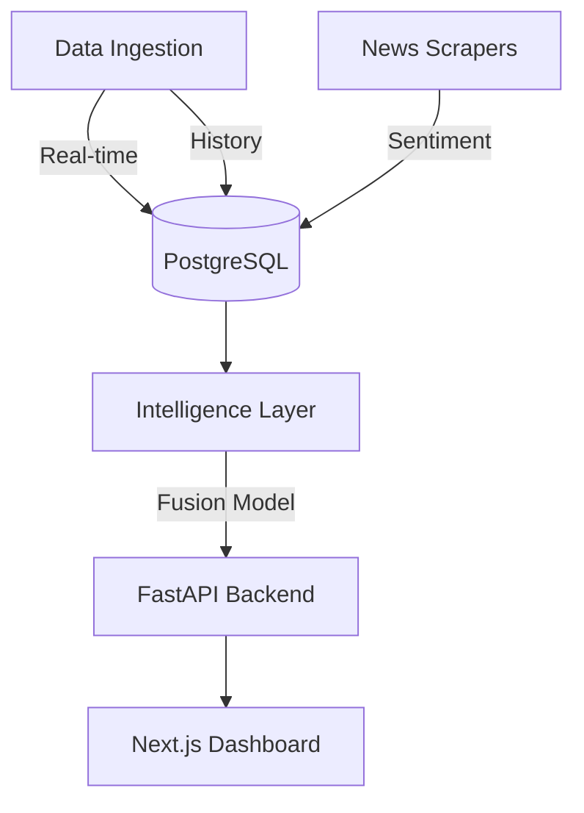

# 🌌 TradeIntellect: AI-Driven Multimodal Stock Intelligence

[](https://nextjs.org/)
[](https://fastapi.tiangolo.com/)
[](https://www.postgresql.org/)
[](https://pytorch.org/)

**TradeIntellect** is a high-performance, real-time stock market intelligence platform that combines **LSTM Neural Networks**, **Technical Analysis**, and **Sentiment Mining** to provide institutional-grade trading signals.

---

## 🏗️ System Architecture

The project is built on a distributed micro-services architecture for maximum scalability and data reliability.



### 📂 Folder Structure & Components

| Folder | Purpose | Key Files |
| :--- | :--- | :--- |
| `api/` | **Backend Core** | `main.py` (FastAPI endpoints, CORS, Robustness layer) |
| `dashboard/` | **Frontend Terminal** | `src/app/` (Next.js 15 pages), `src/components/` (Glassmorphic UI) |
| `db/` | **Persistence Layer** | `schema.py` (SQLAlchemy Models), `init.sql` (Seed Data) |
| `ingestion/` | **Data Pipelines** | `poll_prices.py` (Live Quotes), `news_aggregator.py` (NLP ingestion) |
| `intelligence/` | **AI Logic** | `prediction_service.py` (Signal generator, fallback logic) |
| `models/` | **ML Research** | `price_lstm.py` (Architecture), `fusion_model.py` (Multimodal engine) |

---

## ⚡ Quick Start Guide

### 1. Database Setup (Docker)
Ensure Docker Desktop is running. This creates a persistent PostgreSQL instance with optimized schema.
```bash
docker-compose up -d
```

### 2. Backend Environment
Initialize the Python virtual environment and install dependencies.
```bash
python -m venv venv
source venv/bin/activate  # On Windows: .\venv\Scripts\activate
pip install -r requirements.txt
```

### 3. Frontend Environment
```bash
cd dashboard
npm install
npm run dev
```

### 4. Activate Data Pipelines
In a new terminal, start the background ingestion workers:
```bash
# Terminal A: Live Price Polling
python ingestion/poll_prices.py

# Terminal B: Historical Backfill (Required for first run)
python ingestion/backfill_history.py

# Terminal C: Sentiment Analysis
python ingestion/news_aggregator.py

# Terminal D: API Server
python api/main.py
```

---

## 🧠 Intelligence Engine

### Multimodal Fusion
TradeIntellect doesn't just look at prices. It fuses data from three distinct sources:
1.  **Quantitative**: 150+ days of historical OHLC data processed through an **LSTM (Long Short-Term Memory)** network.
2.  **Qualitative**: Real-time news aggregation with **Sentiment Analysis** scores ranging from Bullish to Bearish.
3.  **Technical**: Real-time calculation of **RSI, MACD, Bollinger Bands, ATR, and VWAP**.

### Self-Healing Logic
- **Symbol Auto-Correction**: Automatically maps NSE and BSE tickers (e.g., `TCS.NS`, `TCS.BO`) for cross-exchange arbitrage.
- **Robustness**: API includes a `clean_nas` utility to handle incomplete market data without crashing the UI.
- **Live Fallback**: If historical data is being backfilled, the system automatically falls back to **Live Quotes** for real-time visibility.

---

## 🎨 UI/UX Features
- **Global Terminal**: A sleek, dark-mode dashboard with neon accents.
- **Dynamic Charts**: Interactive SVG charts with glassmorphism effects.
- **Neural Health**: Live tracking of model accuracy (RMSE) and training status.
- **Signal Confidence**: Real-time percentage-based confidence for AI signals.

---

## 🛡️ License
Distributed under the MIT License. See `LICENSE` for more information.

---
*Built for Institutional-Grade Market Intelligence.*
